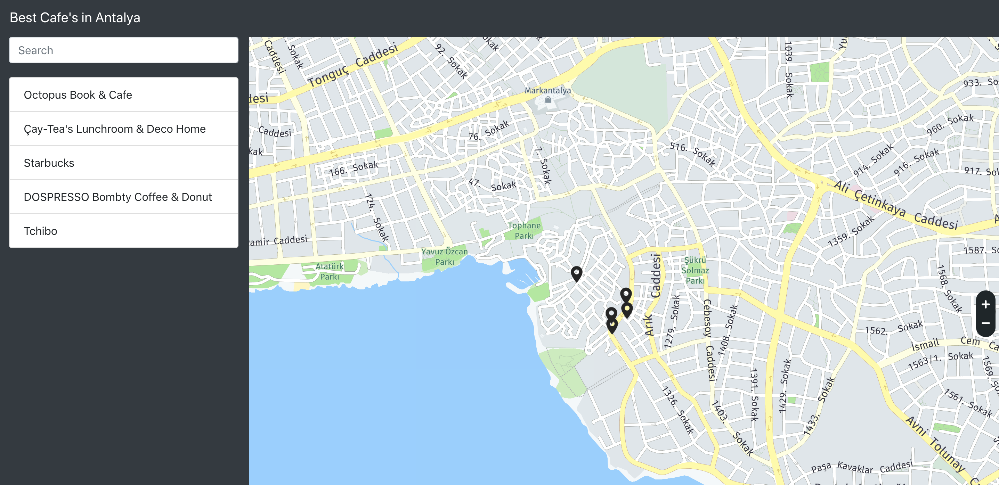
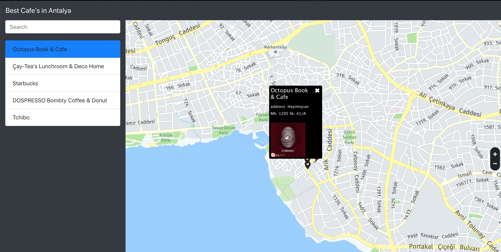
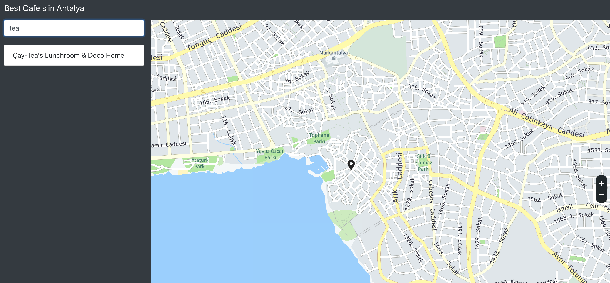

# Catalog project
> Suha Baobaid

## Project Overview
This is the fifth project for the course [ FullStack Nanodegree by Udacity](https://www.udacity.com/course/full-stack-web-developer-nanodegree--nd004 " FullStack Nanodegree by Udacity")
The project consists of developing an application that provides the list of places and their corresponding locations on the map.

List of locations and their corresponding locations on the map can be filtered according to their names. Clicking on a place from the list changes the color of the marker corresponding to the place and displays and info bubble containing name, address and an image of the place retrieved from FORESQUARE.

Third-party api with FORESQUARE and HERE maps is used in this project. Technologies used to build the application include Knockoutjs and Bootstrap.

## Skills required
- Javascript
- Knockoutjs
- HTML
- CSS
- Bootstrap

# Running the project

## Getting Started
- Download or clone the repo
- open index.html in your browser

## ScreenShots
Default

Selecting a place from the list

Filter places

# Issues

- No validation on forms

## Possible improvements

- Implementing CSRF protection on CRUD operations.
- Image upload to associate with items and/or categories
- Front-end improvements

